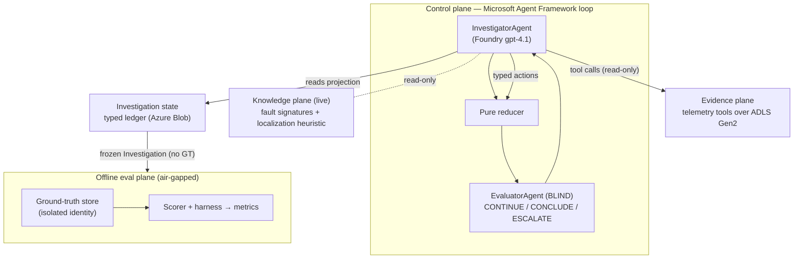

# Deep-RCA

**An experimental, long-running autonomous root-cause investigation system on Microsoft Azure.**

Deep-RCA conducts autonomous, multi-step, **hypothesis-driven** root-cause investigations of
microservice incidents from the [OpenRCA 2.0 / `anon-ops/ops-lite`](https://huggingface.co/datasets/anon-ops/ops-lite)
benchmark. It is **not a chatbot** — it runs an Observe → Hypothesize → Falsify → Collect →
Update-ledger → Evaluate loop, proposes a root cause with a causal path, and submits it to an
independent evaluator that decides `CONTINUE` / `CONCLUDE` / `ESCALATE`.

The runtime agents are built on **Microsoft Agent Framework**; the model is **Azure AI Foundry
`gpt-4.1`**; telemetry lives in **ADLS Gen2 / OneLake**; the investigation ledger is persisted to
Azure Blob. A core experimental constraint is enforced throughout: **benchmark ground truth is
isolated from everything the investigator can see.**

> **Status: Phases 1 & 3 complete — 24/24 tests green (incl. live Azure integration).**
> The Phase-3 knowledge plane takes localization from a Phase-1 **miss** to **exact on 3/3
> incidents** (localization_exact 1.0, fault_type 1.0, valid causal path 1.0, GT-isolation 1.0).

---

## Table of contents
- [Why it's hard](#why-its-hard)
- [Dataset & data contract](#dataset--data-contract)
- [Architecture](#architecture)
- [Ground-truth isolation](#ground-truth-isolation-the-core-constraint)
- [Core loop, models & agents](#core-loop-models--agents)
- [Evidence Plane tools](#evidence-plane-tools)
- [Knowledge plane](#knowledge-plane-phase-3)
- [Results](#results)
- [Repository layout](#repository-layout)
- [Azure footprint](#azure-footprint-phase-1-leaner)
- [Quickstart](#quickstart)
- [Local demo UI](#local-demo-ui-gradio)
- [Roadmap](#roadmap)
- [Notes & gotchas](#notes--gotchas)

---

## Why it's hard

Each OpenRCA 2.0 case injects a fault (e.g. `PodFailure`) into a microservice system and records
telemetry *before* and *during* the fault. The twist: a service hit by `PodFailure` **stops
emitting telemetry** — its spans/metrics go *missing* while its callers show errors, and other
services can go silent as a **cascade**. A naive investigator blames the loudest erroring caller
(or a noisy resource counter). Correctly localizing requires reasoning about **absent telemetry**,
**pod-health signals**, and **dependency topology** to separate the true root from downstream
victims — a genuinely hard RCA problem that Phase 1 gets wrong and Phase 3 gets right.

---

## Dataset & data contract

Each incident is a case directory `cases/<name>/` (the ops-lite row `name` is the join key):

| Visible to Investigator (Evidence Plane) | Ground truth (isolated, offline only) |
|---|---|
| `env.json` — namespace + normal/abnormal time windows | `label.json` — injected faults (the answer) |
| `normal_*` vs `abnormal_*` parquet: `metrics`, `metrics_sum`, `metrics_histogram`, `logs`, `traces` | `injection.json` — injected faults + exact times |
| topology **derived** from traces | `causal_graph.json` — verified propagation graph |
| | ops-lite GT columns (`root_services`, `chaos_types`, `n_*_faults`) |

Telemetry is OpenTelemetry-style (metrics: `time, metric, value, service_name, attr.k8s.*,
attr.*_workload`; traces: `trace_id, span_id, parent_span_id, span_name, service_name, duration,
attr.status_code, attr.http.*`; logs: `level, message, service_name, attr.k8s.*`). The Investigator
builds its `Incident` from `env.json` + `system` only and **never** reads the GT files or the
ops-lite GT row.

---

## Architecture

Four strictly separated planes. Arrows are the only permitted data flows.



Two foundational principles:

1. **Ledger-as-truth.** The authoritative state is the typed, persisted `Investigation` aggregate.
   The LLM is a *stateless step function*: each step it reads a deterministic **projection** of the
   ledger and emits a **typed action**; a pure reducer applies it; the ledger is checkpointed.
   Conversation history is never authoritative — dropping it never loses investigation state.

2. **Two evaluation surfaces, only one sees ground truth.**
   - The **in-loop `EvaluatorAgent` is blind** — it critiques internal quality (evidence
     sufficiency, causal/temporal validity, contradictions, alternatives) and emits one decision.
   - The **offline Evaluation Framework** is the *sole* GT consumer; it scores a frozen result and
     never feeds back into a live investigation.

### Ground-truth isolation (the core constraint)

Isolated three ways, all verified:

- **Identity (production):** the Investigator managed identity has **zero** roles on the GT store;
  only the eval identity can read it (verified at provisioning).
- **Static:** nothing under `src/deeprca/` may import `eval/` — enforced by `tests/isolation/`.
- **Runtime:** a scan asserts no GT markers (GT account, GT filenames, injection UUIDs) appear in
  the Investigator-visible projection or ledger. Service names are **not** scanned — they appear
  legitimately in telemetry, and naming the culprit is the goal, not a leak.

---

## Core loop, models & agents

### State machine
```
INITIALIZED → OBSERVING → HYPOTHESIZING → EVIDENCE_PLANNING → COLLECTING
  → LEDGER_UPDATE → EVALUATION
      CONTINUE → HYPOTHESIZING (within step/cost budget)
      CONCLUDE → PROPOSE_ROOT_CAUSE → EVALUATION(final) → CONCLUDED
      ESCALATE → ESCALATED (human-in-the-loop)
  terminal: CONCLUDED | ESCALATED | BUDGET_EXHAUSTED
```

### Typed domain models (`src/deeprca/models/core.py`)
`Incident` (no root-cause fields), `Evidence` (mandatory provenance), `Hypothesis` (tracks both
supporting **and** contradicting evidence + a falsification test), `ToolCall`, `CausalPath`
(graph-valid + temporally monotonic), `Investigation` (the ledger), `Evaluation`, `Escalation`.

### Typed actions (the only ledger mutations, applied by the pure reducer)
`propose_hypothesis` · `request_evidence(tool, args)` · `link_evidence(supporting/contradicting, status)`
· `propose_root_cause(root_services, fault_type, causal_path)` — plus internal `record_evidence`,
`record_evaluation`, `set_escalation`, `tick`.

### Agents (Microsoft Agent Framework on Foundry `gpt-4.1`)
- **InvestigatorAgent** — sees a GT-free projection; returns exactly one typed action per step.
- **EvaluatorAgent (BLIND)** — independent critic; never sees GT; returns exactly one decision
  (`CONTINUE`/`CONCLUDE`/`ESCALATE`) after challenging evidence sufficiency, causal & temporal
  validity, contradictions, and unaddressed alternatives.

---

## Evidence Plane tools

Each tool compares the normal baseline vs. the abnormal window and returns compact `Evidence` with
mandatory provenance. Nothing reads ground truth.

| Tool | What it returns |
|---|---|
| `query_metrics` | largest metric shifts (abnormal vs normal), with byte/IO counters de-noised |
| `query_traces` | per-service error-rate increase and latency ratio |
| `query_logs` | error/warn log volume per service with samples |
| `get_topology` | baseline dependency graph (caller→callee) from **normal** traces |
| `detect_silent_services` | services whose spans largely disappeared (failure / lost traffic) |
| `pod_health` | `deployment.available < desired` — the **PodFailure signature**; separates a killed service (root) from one that merely lost traffic (victim) |

---

## Knowledge plane (Phase 3)

`src/deeprca/knowledge/` encodes **system knowledge** (not ground truth) as code — the ontology
made actionable. It is injected into the GT-free projection.

- **Fault signatures** — each maps a fault type to its telemetry pattern + decisive signal:
  `PodFailure` (deployment.available < desired, spans vanish), `CPUStress` (cpu saturates, pods
  stay available), `NetworkDelay` (caller latency up, no pod failure), `ConfigError/AppBug`
  (errors up, pods available).
- **Localization heuristic** — *localize to the deepest independently-failed node, not the loudest
  erroring caller; a silent service whose pods stayed available is a cascaded victim, not the root;
  map propagation along the dependency graph from each root to the symptoms.*

Future phases materialize this in **Fabric Ontology + a knowledge graph + Foundry IQ**.

---

## Results

Measured by the offline scorer over `hs` PodFailure incidents (`eval/harness.py`):

| Incident | Proposed (Phase 3) | Ground truth | Result |
|---|---|---|---|
| `…SWG9FS` | `['geo','profile']` | `['geo','profile']` | ✅ exact |
| `…GPT3` | `['profile','recommendation']` | `['profile','recommendation']` | ✅ exact |
| `…QJT3A` | `['profile','search']` | `['profile','search']` | ✅ exact |

**Aggregate (3 cases):** localization_exact **1.0** · fault_type **1.0** · causal_path_valid
**1.0** · isolation_clean **1.0**.

### Ablation — the knowledge plane is what matters
Same incident, two modes (toggleable in the UI):

| Mode | Tools available | Proposed | Result |
|---|---|---|---|
| **Phase 1 — baseline (knowledge OFF)** | metrics/traces/logs/topology | `['search']` | ❌ MISS |
| **Phase 3 — knowledge ON** | + `pod_health`, `detect_silent_services` + heuristic | `['geo','profile']` | ✅ HIT |

Across the loop the **blind Evaluator** typically returns `CONTINUE` several times (e.g. forcing
`CPUStress` to be ruled out) before `CONCLUDE` — it is an independent critic, not a rubber stamp.

---

## Repository layout

```
src/deeprca/
  models/       typed domain (incident, evidence, hypothesis, investigation, …)
  state/        ledger reducer (pure) + typed actions + Blob ledger store
  evidence/     Evidence Plane: ADLS adapter, incident loader, tools
  knowledge/    knowledge plane: fault signatures + localization heuristic (ontology-as-code)
  projection/   ledger → GT-free agent view (the only thing the LLM sees)
  agents/       investigator.py · evaluator.py (Agent Framework agents)
  workflow/     the investigation loop / state machine
  config.py     runtime config (evidence + state + model only; NO ground truth)
eval/           OFFLINE plane — ground_truth/ loader, gt_store, scorer, harness (only GT access)
app/            ui.py — local Gradio demo UI (Investigate + Architecture tabs)
tests/          unit/ · isolation/ (import-ban) · integration/ (live Azure, Phase 1 + Phase 3)
docs/           architecture.md · ontology.md · evaluation.md
infra/          provisioning helpers, load_incident.py, run_phase1.py, demo_phase1.py
tests.json      machine-readable acceptance manifest (Phase 1 + Phase 3, all pass)
```

CI rule: `src/deeprca/**` importing `eval/**` is a hard failure.

---

## Azure footprint (Phase 1, "leaner")

| Plane | Service |
|---|---|
| Models | Azure AI Foundry `gpt-4.1` (Responses API, `api_version=preview`) |
| Evidence lake | ADLS Gen2 (HNS) — OneLake-swap-ready |
| State (ledger) | Azure Blob |
| Isolated GT store | separate Storage account + managed identity (investigator has no access) |
| Identities | user-assigned MIs for investigator and eval, with scoped RBAC |

Auth is `DefaultAzureCredential` (AAD) end-to-end — no keys in the runtime path. **Deviations from
the original infra plan** (to protect the MSDN spending cap): Cosmos → Blob for the ledger (East US
Cosmos is region-locked on MSDN; Cosmos returns in Phase 2) and App Insights deferred to Phase 5.

---

## Quickstart

### Prerequisites
- Python 3.10+, Azure CLI (`az login`), an Azure subscription (East US used here).
- An Azure AI Foundry resource with a `gpt-4.1` deployment.

### 1. Install
```bash
python -m venv .venv
.venv/Scripts/python -m pip install -e ".[azure,dev,demo]"   # Windows; use .venv/bin on *nix
```

### 2. Provision (leaner footprint) & load incidents
Create the storage accounts, identities, and RBAC (see `infra/` and `docs/architecture.md`), copy
`infra/runtime.env.example` → `infra/runtime.env` and fill it in, then load telemetry + GT:
```bash
python infra/load_incident.py <CASE_NAME> \
  --evidence-account <evid> --evidence-key <key> \
  --gt-account <gt> --gt-key <key>
```

### 3. Run the tests
```bash
.venv/Scripts/python -m pytest -q                            # unit + isolation (offline)
set -a; source infra/runtime.env; set +a                     # for the live slices
PYTHONPATH="src;." .venv/Scripts/python -m pytest -m azure -q # Phase-1 + Phase-3 integration
```

### 4. CLI demo & batch eval
```bash
set -a; source infra/runtime.env; set +a
PYTHONIOENCODING=utf-8 PYTHONPATH="src;." .venv/Scripts/python infra/demo_phase1.py   # one incident, narrated
PYTHONPATH="src;." .venv/Scripts/python eval/harness.py <case1> <case2> <case3>       # aggregate scorecard
```

## Local demo UI (Gradio)
```bash
set -a; source infra/runtime.env; set +a
PYTHONPATH="src;." python app/ui.py        # opens http://localhost:7860
```
Two tabs:
- **🔎 Investigate** — pick an incident and a **mode**, click **Run investigation**. The UI streams
  the live timeline (hypotheses → tool findings → blind-Evaluator verdicts → proposal), then reveals
  ground truth from the offline plane with the scorecard, hypothesis ledger, and GT-isolation check.
  The **mode toggle** is an ablation (Phase 3 knowledge ON vs Phase 1 baseline) — run the same
  incident in both to watch the knowledge plane flip a **miss** into a **hit**.
- **🏛️ Architecture & Design** — the four planes, isolation guarantees, core loop, typed models,
  the two agents, the live Evidence-Plane tool registry, and the knowledge-plane fault signatures.

---

## Roadmap

1. **✅ Phase 1** — end-to-end vertical slice: one incident, GT hidden, ≥3 tool calls, persistent
   ledger, proposal, blind evaluator, offline scoring, isolation verified.
2. **Phase 2** — real Evidence Plane on Microsoft Fabric/OneLake + Cosmos state + richer tools.
3. **✅ Phase 3** — Knowledge plane (accuracy lever): fault signatures + localization heuristic,
   `pod_health` / `detect_silent_services` tools, baseline topology, "root vs cascaded victim"
   reasoning. **Exact localization on 3/3 hs PodFailure incidents.**
4. **Phase 4** — rigorous blind Evaluator (falsification, decision policy; a *second* model to
   reduce correlated errors).
5. **Phase 5** — durable long-running execution via Agent Framework **Durable Extension** + HITL.
6. **Phase 6** — full benchmark scale (all 455 scenarios, more systems/fault types) + metrics.
7. **Phase 7** — hardening: GT-isolation red-team, cost/safety guardrails, reproducibility.

---

## Notes & gotchas
- Azure OpenAI **Responses API** (used by Agent Framework) needs `api_version=preview` here.
- Run the whole investigation under **one asyncio event loop** (the chat client binds its async
  HTTP pool to the running loop; a loop-per-call closes it).
- On Git Bash, `az ... --scope /subscriptions/...` gets path-mangled — prefix with
  `MSYS_NO_PATHCONV=1`.
- Creating/modifying Azure resources in this tenant requires **MFA** step-up (`az login --scope
  https://management.core.windows.net//.default` after `az logout`).

## License
Apache-2.0 (matching the ops-lite dataset). Experimental research code.
