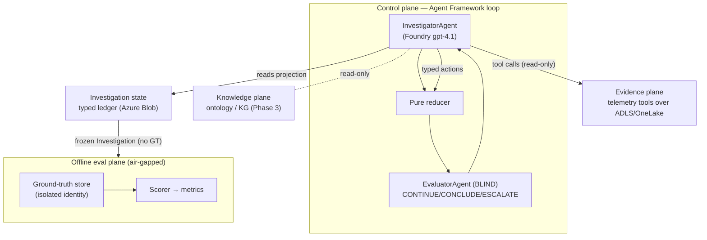

# Deep-RCA

**An experimental, long-running autonomous root-cause investigation system on Microsoft Azure.**

Deep-RCA conducts autonomous, multi-step, **hypothesis-driven** root-cause investigations of
microservice incidents from the [OpenRCA 2.0 / `anon-ops/ops-lite`](https://huggingface.co/datasets/anon-ops/ops-lite)
benchmark. It is **not a chatbot** — it runs an Observe → Hypothesize → Falsify → Collect →
Update-ledger → Evaluate loop, proposes a root cause with a causal path, and submits it to an
independent evaluator that decides `CONTINUE` / `CONCLUDE` / `ESCALATE`.

The runtime agents are built on **Microsoft Agent Framework**; the model is **Azure AI Foundry
`gpt-4.1`**; telemetry lives in **ADLS Gen2 / OneLake**; and the investigation ledger is persisted
to Azure Blob. A core experimental constraint is enforced throughout: **benchmark ground truth is
isolated from everything the investigator can see.**

> **Status: Phases 1 & 3 complete — 24/24 tests green (incl. live Azure integration).**
> Phase 3 (knowledge plane) takes localization from a Phase-1 miss to **exact on 3/3 incidents**
> (localization_exact 1.0, fault_type 1.0, valid causal path 1.0, GT-isolation clean 1.0).

---

## Why it's interesting

Each OpenRCA 2.0 case injects a fault (e.g. `PodFailure`) into a microservice system and records
the telemetry *before* and *during* the fault. The twist: a service hit by `PodFailure` often
**stops emitting telemetry** — its spans/metrics go *missing* while its callers show errors. A
naive investigator blames the loudest erroring caller. Correctly localizing the fault requires
reasoning about **absent telemetry** and **dependency topology** — a genuinely hard RCA problem.

---

## Architecture

Four strictly separated planes. Arrows are the only permitted data flows.



Two foundational principles:

1. **Ledger-as-truth.** The authoritative state is the typed, persisted `Investigation` aggregate.
   The LLM is a *stateless step function*: each step it reads a deterministic **projection** of the
   ledger and emits a **typed action**; a pure reducer applies it; the ledger is checkpointed.
   Conversation history is never authoritative.

2. **Two evaluation surfaces, only one sees ground truth.**
   - The **in-loop `EvaluatorAgent` is blind** — it critiques internal quality (evidence
     sufficiency, causal/temporal validity, contradictions, alternatives) and emits one decision.
   - The **offline Evaluation Framework** is the *sole* GT consumer; it scores a frozen result and
     never feeds back into a live investigation.

### Ground-truth isolation (the core constraint)

GT = `label.json` + `injection.json` + `causal_graph.json` + the ops-lite GT columns. It is isolated
three ways, all verified:

- **Identity (production):** the Investigator managed identity has **zero** roles on the GT store;
  only the eval identity can read it.
- **Static:** nothing under `src/deeprca/` may import `eval/` (enforced by `tests/isolation/`).
- **Runtime:** a scan asserts no GT markers (GT account, GT filenames, injection UUIDs) appear in
  the Investigator-visible projection or ledger.

---

## The core investigation loop

```
INITIALIZED → OBSERVING → HYPOTHESIZING → EVIDENCE_PLANNING → COLLECTING
  → LEDGER_UPDATE → EVALUATION
      CONTINUE → HYPOTHESIZING (within budget)
      CONCLUDE → PROPOSE_ROOT_CAUSE → EVALUATION(final) → CONCLUDED
      ESCALATE → ESCALATED (human-in-the-loop)
  terminal: CONCLUDED | ESCALATED | BUDGET_EXHAUSTED
```

## Typed domain models

`Incident` (no root-cause fields), `Evidence` (mandatory provenance), `Hypothesis` (tracks both
supporting **and** contradicting evidence + a falsification test), `ToolCall`, `CausalPath`
(graph-valid + temporally monotonic), `Investigation` (the ledger), `Evaluation`, `Escalation`.
See `src/deeprca/models/core.py` and `docs/architecture.md`.

## Evidence Plane tools

`query_metrics`, `query_traces`, `query_logs`, `get_topology` — each compares the normal baseline
vs. the abnormal window and returns compact `Evidence` with provenance. Topology is **derived from
traces** (not read from ground truth).

---

## Repository layout

```
src/deeprca/
  models/       typed domain (incident, evidence, hypothesis, investigation, …)
  state/        ledger reducer (pure) + typed actions + Blob ledger store
  evidence/     Evidence Plane: ADLS adapter, incident loader, tools
  projection/   ledger → GT-free agent view (the only thing the LLM sees)
  agents/       investigator.py · evaluator.py (Agent Framework agents)
  workflow/     the investigation loop / state machine
  config.py     runtime config (evidence + state + model only; NO ground truth)
  knowledge/    knowledge plane: fault signatures + localization heuristic (ontology-as-code)
eval/           OFFLINE plane — ground_truth/ loader, gt_store, scorer, harness (only GT access)
tests/          unit/ · isolation/ (import-ban) · integration/ (live Azure slice)
docs/           architecture.md · ontology.md · evaluation.md
infra/          provisioning helpers, data loader, Phase-1 runner + live demo
```

CI rule: `src/deeprca/**` importing `eval/**` is a hard failure.

---

## Azure footprint (Phase 1, "leaner")

| Plane | Service |
|---|---|
| Models | Azure AI Foundry `gpt-4.1` (Responses API, `api_version=preview`) |
| Evidence lake | ADLS Gen2 (HNS) — OneLake-swap-ready |
| State (ledger) | Azure Blob (Cosmos deferred to Phase 2) |
| Isolated GT store | separate Storage account + managed identity (investigator has no access) |
| Identities | user-assigned MIs for investigator and eval, with scoped RBAC |

Auth is via `DefaultAzureCredential` (AAD) end-to-end — no keys in the runtime path.

---

## Quickstart

### Prerequisites
- Python 3.10+, Azure CLI (`az login`), an Azure subscription (East US used here).
- An Azure AI Foundry resource with a `gpt-4.1` deployment.

### 1. Install
```bash
python -m venv .venv
.venv/Scripts/python -m pip install -e ".[azure,dev]"   # Windows; use .venv/bin on *nix
```

### 2. Provision (leaner footprint) & load one incident
Create the storage accounts, identities, and RBAC (see `infra/` and `docs/architecture.md`), then:
```bash
python infra/load_incident.py <CASE_NAME> \
  --evidence-account <evid> --evidence-key <key> \
  --gt-account <gt> --gt-key <key>
```
Copy `infra/runtime.env.example` → `infra/runtime.env` and fill in your resources.

### 3. Run the tests (unit + isolation always; integration needs Azure)
```bash
.venv/Scripts/python -m pytest -q                      # unit + isolation (offline)
set -a; source infra/runtime.env; set +a               # for the live slice
PYTHONPATH="src;." .venv/Scripts/python -m pytest -m azure -q
```

### 4. Live demo
```bash
set -a; source infra/runtime.env; set +a
PYTHONIOENCODING=utf-8 PYTHONPATH="src;." .venv/Scripts/python infra/demo_phase1.py
```
It narrates hypotheses forming, tool calls and findings, the blind Evaluator's verdicts, the final
proposal, then reveals ground truth (offline) and prints the scorecard + isolation check.

### 5. Local web UI (Gradio)
```bash
pip install -e ".[demo]"                                # installs gradio
set -a; source infra/runtime.env; set +a
PYTHONPATH="src;." python app/ui.py                      # opens http://localhost:7860
```
Pick an incident from the dropdown and click **Run investigation**. The UI streams the live
timeline (hypotheses, tool findings, blind-Evaluator verdicts, proposal), then reveals ground
truth from the offline plane with the scorecard, hypothesis ledger, and GT-isolation check.

---

## Phase 1 results

A real run: the Investigator formed competing hypotheses (PodFailure vs. overload), made 3+ tool
calls, refuted one hypothesis, proposed a root cause, and the **blind Evaluator returned CONTINUE
several times** before CONCLUDE. The ledger persisted and reloaded byte-identical; the GT-isolation
scan was clean.

It localized `reservation`/ResourceExhaustion; ground truth was `geo`+`profile`/`PodFailure` — a
**miss**, as expected at Phase 1 (the faulted pods went silent and a noisy memory counter misled
the metrics tool). Fixing this is the explicit goal of Phase 3.

Phase-1 acceptance criteria live in `tests.json` (all `pass`).

---

## Roadmap

1. **✅ Phase 1** — end-to-end vertical slice: one incident, GT hidden, ≥3 tool calls, persistent
   ledger, proposal, blind evaluator, offline scoring, isolation verified.
2. **Phase 2** — real Evidence Plane on Microsoft Fabric/OneLake + Cosmos state + richer tools.
3. **✅ Phase 3** — Knowledge plane (accuracy lever): fault signatures + localization heuristic
   (ontology-as-code in `src/deeprca/knowledge/`), `pod_health` / `detect_silent_services` tools,
   baseline topology, and "root vs cascaded victim" reasoning. **Exact localization on 3/3 hs
   PodFailure incidents.** Future: materialize in Fabric Ontology + knowledge graph + Foundry IQ.
4. **Phase 4** — rigorous blind Evaluator (falsification, decision policy; separate model).
5. **Phase 5** — durable long-running execution via Agent Framework **Durable Extension** + HITL.
6. **Phase 6** — full benchmark scale (all 455 scenarios) + batch harness + metrics.
7. **Phase 7** — hardening: GT-isolation red-team, cost/safety guardrails, reproducibility.

---

## Notes & gotchas
- Azure OpenAI **Responses API** (used by Agent Framework) needs `api_version=preview` here.
- Run the whole investigation under **one asyncio event loop** (the chat client binds its HTTP pool
  to the running loop).
- On Git Bash, `az ... --scope /subscriptions/...` gets path-mangled — prefix with `MSYS_NO_PATHCONV=1`.

## License
Apache-2.0 (matching the ops-lite dataset). Experimental research code.
